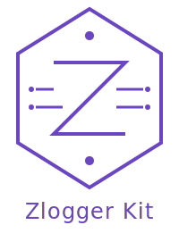

# ZLogger Kit

<p align="center">
  
</p>

[](https://pypi.org/project/zlogger-kit/)
[](https://img.shields.io/pypi/v/zlogger-kit)
[](https://opensource.org/licenses/MIT)


[](https://github.com/psf/black)
[](https://docs.pytest.org/)
[](https://coverage.py/)

ZLogger Kit is a well-rounded logging kit around structlog. It provides middleware for logging requests and responses, as well as a logger for logging messages, with priority levels for each log level: [WARNING, INFO, DEBUG, ERROR].

## Features

- **Logging requests and responses** for all `requests` and `responses`
- **Support Timezone** with the ability to set the timezone, default is `Asia/Riyadh`
- **Logging messages** with priority levels (`P10`, `P20`, `P30`, `P40`)
- **Logging errors, warnings, info, and debug**
- **Logging to file** with the ability to set the log `file path` and `file name`
- **Logging to console** with the ability to set the log `level`
- **Logging with 2 different log formats**
    - **JSON**
    - **TEXT**
- **Easy to use and setup**


## Priority Levels

| Level   | Description                     | Priority |
|---------|---------------------------------|----------|
| DEBUG   | Debug level logging with lowest priority. | P10      |
| INFO    | Informational level logging with low-medium priority. | P20      |
| WARNING | Warning level logging with medium-high priority. | P30      |
| ERROR   | Error level logging with highest priority. | P40      |

## Installation

### Poetry (Recommended)

```bash
poetry add zlogger-kit
```

### Pip

```bash
pip install zlogger-kit
```

## Quick Start

#### Example 1

In this example, we will use the `ZLog` class to log messages to the console and file, with the JSON & TEXT formats and the `AUTH` module.


```python
from zlogger_kit.zlog import ZLog
from zlogger_kit.models import ZLogConfig
from examples.modules import Module

config = ZLogConfig(
    module=Module.AUTH.value,
    json_format=True,
    log_path="logs/auth",
)
logger = ZLog.init(config)

logger.info("Starting authentication process", client_ip="192.168.1.100")
logger.info("Login successful", user_id="user_123")
logger.error(
    "Login failed",
    username="suspicious_user",
    ip="10.0.0.5",
    reason="Invalid credentials",
)
logger.warn(
    "Failed login attempt",
    username="suspicious_user",
    ip="10.0.0.5",
    reason="Invalid credentials",
)
logger.debug("Debug message", user_id="user_123")
logger.warn(
    "Failed login attempt",
    username="suspicious_user",
    ip="10.0.0.5",
    reason="Invalid credentials",
)
```

#### JSON Format

```json
{"timestamp": "2025-02-09T00:25:39.953773+03:00", "module": "AUTH", "priority": "P20", "message": "Starting authentication process", "level": "INFO", "client_ip": "192.168.1.100"}
{"timestamp": "2025-02-09T00:25:39.954158+03:00", "module": "AUTH", "priority": "P20", "message": "Login successful", "level": "INFO", "user_id": "user_123"}
{"timestamp": "2025-02-09T00:25:39.954199+03:00", "module": "AUTH", "priority": "P40", "message": "Login failed", "level": "ERROR", "username": "suspicious_user", "ip": "10.0.0.5", "reason": "Invalid credentials"}
{"timestamp": "2025-02-09T00:25:39.954224+03:00", "module": "AUTH", "priority": "P30", "message": "Failed login attempt", "level": "WARNING", "username": "suspicious_user", "ip": "10.0.0.5", "reason": "Invalid credentials"}
{"timestamp": "2025-02-09T00:25:39.954260+03:00", "module": "AUTH", "priority": "P10", "message": "Debug message", "level": "DEBUG", "user_id": "user_123"}
```

```python
config = ZLogConfig(
    module=Module.AUTH.value,
    json_format=False,
    log_path="logs/auth",
)
```

#### TEXT Format

```json
[INFO]:[P20] [2025-02-09T00:27:14.375037+03:00] Starting authentication process {"level": "INFO", "client_ip": "192.168.1.100"}
[INFO]:[P20] [2025-02-09T00:27:14.375318+03:00] Login successful {"level": "INFO", "user_id": "user_123"}
[ERROR]:[P40] [2025-02-09T00:27:14.375380+03:00] Login failed {"level": "ERROR", "username": "suspicious_user", "ip": "10.0.0.5", "reason": "Invalid credentials"}
[WARNING]:[P30] [2025-02-09T00:27:14.375410+03:00] Failed login attempt {"level": "WARNING", "username": "suspicious_user", "ip": "10.0.0.5", "reason": "Invalid credentials"}
[DEBUG]:[P10] [2025-02-09T00:27:14.375453+03:00] Debug message {"level": "DEBUG", "user_id": "user_123"}
```


#### Example 2

In this example, we will use the `ZLogMiddleware` class to log requests and responses, with the JSON format and the `PAYMENT` module.

#### example2.py
```python
from fastapi import FastAPI
from examples.modules import Module
from zlogger_kit.middleware import ZLogMiddleware
from zlogger_kit.zlog import ZLog
from zlogger_kit.models import ZLogConfig
from examples.routers.payment_router import router as payment_router

app = FastAPI(title="Payment Service", description="API for payment processing")

zlogger = ZLog.init(
    ZLogConfig(
        module=Module.PAYMENT.value,
        log_path="logs",
        time_zone="Asia/Riyadh",
        json_format=False,
    )
)

app.add_middleware(ZLogMiddleware, logger=zlogger)

app.include_router(payment_router)


@app.get("/health")
async def health():
    """Health check endpoint"""
    return {"status": "healthy"}


@app.get("/")
async def root():
    return {"message": "Welcome to the Payment Service API 💸"}
```

#### routers/payment_router.py
```python
from fastapi import APIRouter, HTTPException
from examples.modules import Module
from zlogger_kit.models import ZLogConfig
from zlogger_kit.zlog import ZLog

router = APIRouter(
    prefix="/payments",
    tags=["payments"],
    responses={404: {"description": "Not found"}},
)

logger = ZLog.init(
    ZLogConfig(
        module=Module.PAYMENT.value, log_path="logs", time_zone="UTC", json_format=False
    )
)


@router.post("")
async def create_payment():
    """Create a new payment"""
    try:
        return {"payment_id": "pay_123", "status": "succeeded", "amount": 1000}
    except Exception as e:
        logger.error(f"Payment failed: {str(e)}")
        raise HTTPException(status_code=400, detail="Payment failed")


@router.get("/{payment_id}")
async def get_payment(payment_id: str):
    """Get payment details by ID"""
    return {
        "payment_id": payment_id,
        "status": "succeeded",
        "amount": 1000,
        "created_at": "2024-03-20T10:00:00Z",
    }


@router.post("/{payment_id}/refund")
async def refund_payment(payment_id: str):
    """Refund a payment"""
    try:
        return {
            "refund_id": "ref_123",
            "payment_id": payment_id,
            "status": "succeeded",
            "amount": 1000,
        }
    except Exception as e:
        logger.error(f"Refund failed: {str(e)}")
        raise HTTPException(status_code=400, detail="Refund failed")
```


#### Run the example

```bash
poetry run uvicorn examples.example2:app --reload
```

#### logs/payment-2025-02-08.log
```json
[INFO]:[P20] [2025-02-08T21:01:35.591221+00:00] POST http://127.0.0.1:8000/payments {"level": "INFO", "operation": "request", "method": "POST", "url": "http://127.0.0.1:8000/payments", "ip": "127.0.0.1"}
[INFO]:[P20] [2025-02-08T21:01:35.592402+00:00] 200 {"level": "INFO", "operation": "response", "status_code": 200, "ip": "127.0.0.1"}
[INFO]:[P20] [2025-02-08T21:01:40.856986+00:00] POST http://127.0.0.1:8000/payments/xx {"level": "INFO", "operation": "request", "method": "POST", "url": "http://127.0.0.1:8000/payments/xx", "ip": "127.0.0.1"}
[INFO]:[P20] [2025-02-08T21:01:40.857824+00:00] 200 {"level": "INFO", "operation": "response", "status_code": 200, "ip": "127.0.0.1"}
[INFO]:[P20] [2025-02-08T21:01:41.037139+00:00] GET http://127.0.0.1:8000/health {"level": "INFO", "operation": "request", "method": "GET", "url": "http://127.0.0.1:8000/health", "ip": "127.0.0.1"}
```

## Contributing

Contributions are welcome! Please feel free to submit a PR.


## Contributors

- [Abdullah Alqahtani](https://github.com/anqorithm)

## License

This project is licensed under the MIT License. See the [LICENSE](LICENSE) file for details.